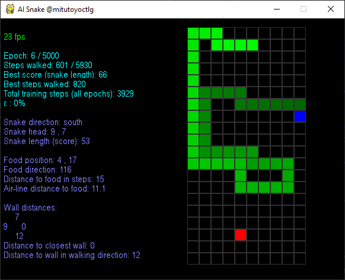
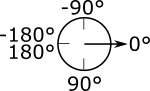
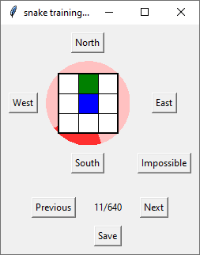
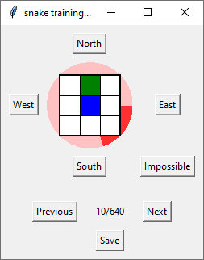
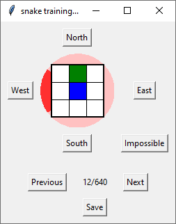
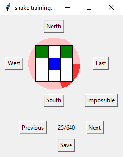
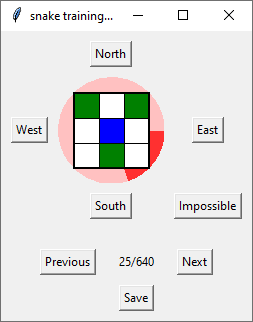
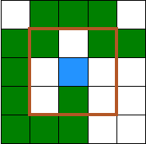

# AI-Preparation
Vorbereitung auf die Umsetzung von Machine Learning (eine Untermenge von künstlicher Intelligenz) für das Spiel "Snake".

Dieses Projekt entstand ursprünglich als Teil der Berufsorientierung für Gymnasien (BOGY) für das [Leibnitz-Gymnasium in Rottweil](https://lg.rw.schule-bw.de/home/?page_id=11268) im Schuljahr 2019/2020. Nach Ausbruch des Corona-Virus wurde das BOGY offiziell abgesagt. Wir freuen uns, dass die Schüler das Praktikum dennoch freiwillig fortführen wollten. Als Firmenpartner stand [Mitutoyo CTL in Oberndorf](http://www.mitutoyo-ctl.de/de/karriere/ausbildungundstudium) mit Hardware, Räumlichkeiten und Ansprechpartnern zur Verfügung.

Inspiration für dieses Projekt war das [Leibniz Forschungszentrum](https://lg.rw.schule-bw.de/home/?cat=120) mit einer Idee, die Bewegung von Ameisen vom Computer vorherzusagen. Die Original-Idee beinhaltete ein Terrarium mit echten Ameisen, Kamera usw. Eine solch reale Umgebung birgt jedoch Schwierigkeiten, die mit den Rahmenbedingungen eines Praktikums schlecht vereinbar sind, z.B.:

* wer kümmert sich um die Ameisen? Möglicherweise sterben sie ausgerechnet alle am ersten Tag der Praktikumswoche.
* wie nehmen die Teilnehmer das Ergebnis samt Ameisen mit nach Hause, um es Eltern und Freunden zu zeigen?
* sind die Ergebnisse reproduzierbar? Wir können bei einer fehlerhaften Umsetzung nicht nochmal am gleichen Startpunkt begonnen.
* passt das Projekt in den Zeitrahmen?

Aus diesem Grund haben wir uns entschlossen, zwar ein Machine Learning Projekt durchzuführen, aber die Bedingungen zu unseren Gunsten anzupassen. Entstanden ist ein Snake-Spiel, bei dem der Computer selbst die Spielregeln erlernen soll und dann die richtigen Aktionen durchführt.

# Projekt-Umgebung

## Software

Wir verwenden kostenlose Software: 

* das Betriebssystem [Raspbian](https://www.raspberrypi.org/downloads/raspbian/) für den Raspberry Pi 4.  Wir verwenden die Version mit 4GB Speicher, da wir für ein Experiment viel RAM benötigen.
* die Programmiersprache [Python](https://www.python.org/)
* die Entwicklungsumgebung [PyCharm von JetBrains](https://www.jetbrains.com/de-de/pycharm/) (Community Edition)
* die Bibliotheken [Tensorflow](https://www.tensorflow.org/), [Keras](https://keras.io/) und [OpenAI Gym](https://gym.openai.com/)
* die Versionsverwaltung [Git](https://git-scm.com/) mit dem Provider [Github](https://github.com/)
* dazu unter Windows den [Editor Notepad++](https://notepad-plus-plus.org/) und das Difftool [Winmerge](https://winmerge.org/?lang=de)

## Daten

Im Rahmen des Projekts erzeugen sich die Daten aus dem Spielverlauf selbst.

# Vorbereitung / Einführung

Bei unserem Praktikum handelt es sich um ein erweitertes BOGY / erweitertes Praktikum. Das bedeutet, dass zusätzlich zur Praktikumswoche noch 6 Nachmittage zur Verfügung stehen, an denen die Grundlagen vermittelt werden können. Dadurch läuft die Praktikumswoche einfach flüssiger und die Schüler bekommen auch echte Ergebnisse hin.

## Erster Nachmittag, 12.2.2020

Am ersten Nachmittag haben wir uns zunächst vorgestellt und dann durch die Firma geführt, um die Räumlichkeiten kennenzulernen.

Die [Firmenpräsentation](presentation/Firmenpräsentation.pptx) ging noch etwas darüber hinaus und erklärt unser Motto, nennt die von uns entwickelte Software, erklärt das duale Studium und zeigt Beispiele von Praktikumsprojekten.

Wir haben uns die Hardware angeschaut, auf dem wir das Projekt durchführen möchten. Es handelt sich um einen [Raspberry Pi 4](presentation/Raspberry%20Hardware.pptx), der Dank der Speichererweiterung auf 4 GB auch größere Datenmengen verarbeiten kann, wie sie bei Machine Learning auftreten.

Dann haben wir uns mit dem Thema der Berufsorientierung auseinandergesetzt. Das Spielprinzip ist vermutlich hinreichend bekannt: es handelt sich um ein Snake-Spiel. Die Schlange (grün) frisst mit ihrem Kopf (blau) einen Apfel (rot) und wächst dabei. Zum Glück sind wir hier nicht an fächerübergreifenden Unterricht gebunden, ansonsten müsste man sich fragen, seit wann Schlangen vegetarisch sind (Biologie), ob nicht Adam und Eva den Apfel gegessen haben, anstatt der Schlange (Religion) und ob Schlangen mit künstlicher Intelligenz ein Bewusstsein haben, und somit überhaupt in Tierversuchen einsetzbar sind (Ethik).

Die von uns bereitgestellte Spieleumgebung ist bereits auf KI-Experimente vorbereitet, d.h. ein beliebiger Algorithmus kann in der Umgebung mehrere Spiele nacheinander ohne menschliches Zutun spielen. Zur Spieleumgebung gibt es eine Visualisierung, die folgendermaßen aufgebaut ist:

* der linke Bereich liefert statistische Daten
  * grün: Daten zur Visualisierung, derzeit nur die aktuelle Visualisierungsgeschwindigkeit in Bildern pro Sekunde (fps; frames per second)
  * hellblau: Daten zum Training, d.h. mehrere Spiele übergreifend
  * violett: Daten zum aktuell laufenden Spiel. Ein Teil dieser Daten könnte als Input für Neuronen dienen.
* der rechte Bereich visualisiert das Spielfeld
  * rot: das Futter (angeblich ein Apfel)
  * blau: der Kopf der Schlange
  * grün: Körper der Schlange, wobei die hellere Teile früher verschwinden als dunklere Teile

Im Bild sieht man einen von Mitutoyo programmierten Algorithmus, der noch keine künstliche Intelligenz nutzt. Dabei handelt es sich bewusst um einen Algorithmus, der nicht mathematisch als perfekt bewiesen ist. Unsere KI wird sich mit diesem Algorithmus messen müssen. Bei 1000 Spielen erreicht er eine Länge von bis zu 80 Kästchen, was einer Abdeckung von 40% der Fläche entspricht. 



Hausaufgaben:

* Github Account einrichten, damit wir später gemeinsam an einem Projekt arbeiten können

* Fotofreigabe von den Eltern ausfüllen und unterschreiben lassen

* der Whatsapp-Gruppe für das Praktikum beitreten

* bei Interesse unserem [Instagram Account](https://www.instagram.com/mitutoyoctlg/) folgen.

## Zweiter Nachmittag, 19.2.2020

Wie bereits am ersten Tag kurz vorgestellt, haben wir ein "Daily Scrum" Meeting durchgeführt. Die Themen im BOGY weichen etwas von den üblichen Fragen für Entwickler ab. Wir wollten wissen, ob die Hausaufgaben erledigt sind und ob es sonstige Vorkommnisse gab, die das BOGY betreffen könnten.

Bereits am ersten Nachmittag haben wir zum Schluss den Raspberry Pi in Betrieb genommen und die Oberfläche vom Betriebssystem Raspbian kennengelernt. Heute haben wir uns etwas mehr mit den Innereien von Linux beschäftigt: Die [Linux Präsentation](presentation/Linux.pptx) erklärt den grundsätzlichen Aufbau, ist allerdings theoretischer Natur. Daher haben wir diese Präsentation gekürzt, indem wir Teile in ausgeblendeten Folien versteckt haben. Die [Bash Präsentation](presentation/Bash.pptx) zeigt, was man auf er Linux Kommandozeile alles tun kann und hat den deutlich höheren Praxisanteil. 

Wir schließen diese beiden Teile ab mit der Behauptung: wer ein guter Hacker werden möchte, kommt um Linux nicht herum. (Der Begriff Hacker wird hier in seinem positiven Sinn als Tüftler mit Sinn für kreativen Umgang mit Technik verstanden)

## Dritter Nachmittag, 4.3.2020

Wir starteten mit der [Einführung in PyCharm](presentation/Pycharm.pptx). Da wir PyCharm bereits auf dem Raspberry Pi installiert hatten, haben wir den Installations-Teil übersprungen (die Anleitung verbleibt in versteckten Folien) und haben uns ganz auf die Features dieser IDE (Integrated Development Environment) konzentriert.

Danach legten wir los mit den ersten Schritten in der [Programmiersprache Python](presentation/Python%20Einführung.pptx), um Unterschiede zu anderen Programmiersprachen kennen zu lernen und mit der Syntax vertraut zu werden.

Hausaufgaben:

* Python 3 zu Hause installieren

* [PyCharm Community Edition](https://www.jetbrains.com/de-de/pycharm/download/#section=windows) zu Hause installieren

* bei Interesse eine mathematische [Aufgabe von Project Euler](https://projecteuler.net/archives) lösen

## Vierter Nachmittag, 11.3.2020

Beim Standup Meeting haben wir uns erkundigt, ob die Hausaufgaben Probleme bereitet haben. Dann haben wir bei Folie 44 der [Python Präsentation](presentation/Python%20Einführung.pptx) weitergemacht, wo wir letztes Mal aus Zeitgründen aufgehört haben.

Hinzu kam dann eine Einführung in [Objektorientierung mit Python](presentation/Python%20Objektorientierung.pptx). Dort kamen wir bis Folie 17 und haben mehrere tausend Hunde (Objekte vom Typ Hund) das virtuelle Licht der virtuellen Welt erblicken lassen. Es gab auch für uns Neues zu erlernen, z.B. dass es Jack Russel Jack Parson Terrier Mischlinge gibt.

## Fünfter Nachmittag, 18.3.2020

Aufgrund des Corona-Virus fiel die Berufsorientierung schulweit aus. Auch die Mitutoyo CTL Germany GmbH befand sich komplett im Home Office. Wir haben unser Team gefragt, ob es an einer Fortführung online interessiert wäre. Alle vier Teilnehmer waren dafür. Darüber freuten wir uns sehr 😊. Als Plattform haben wir [GotoMeeting](https://www.gotomeeting.com/de-de/meeting/meeting-beitreten?sc_lang=de-de) verwendet. Davon hat unsere Firma Lizenzen, so dass wir unbegrenzt konferieren konnten.

Wir haben mit der [Objektorientierung mit Python](presentation/Python%20Objektorientierung.pptx) ab Folie 18 weitergemacht, d.h. gleich mit der nächsten Aufgabe, eine Klasse Quader zu erstellen.

Im Anschluss haben wir uns mit dem Thema [Versionskontrolle allgemein](presentation/Versionskontrolle.pptx) beschäftigt, bevor wir dann konkret auf Git eingegangen sind. Für den heutigen Tag haben wir extra eine Präsentation für [Git unter Windows](presentation/Git%20Grundlagen%20-%20Windows.pptx) angelegt. Normalerweise würden wir [Git für Linux](presentation/Git%20Grundlagen.pptx) erklären, da der Raspberry ein Linux Betriebssystem hat. Die Unterschiede halten sich in Grenzen. Es unterscheidet sich lediglich die Installation der Tools. 

Wir finden Versionskontrolle praktisch und können nur empfehlen, das auch privat einzusetzen, beispielsweise für Ausarbeitungen im Rahmen einer GFS (gleichwertige Feststellung von Schülerleistungen).

## Sechster Nachmittag, 25.3.2020

Der heutige Tag befasste sich mit dem Thema [Künstliche Intelligenz](presentation/Künstliche%20Intelligenz.pptx). Ebenfalls in einer Online-Session haben wir geschaut, wie der Stand der Technik bei künstlicher Intelligenz ist, wo sich maschinelles Lernen in der Informatik einordnet und welche Probleme es dabei geben kann.

Ebenfalls besprochen haben wir, wie wir in der Praktikumswoche verfahren möchten. Dieser Vorschlag kam von uns:

* Wir treffen uns morgens um **9:00 Uhr** für eine gemeinsame Besprechung, ggf. mit Präsentation oder Erklärungen.

* Danach gibt es eine Programmieraufgabe, die jeder daheim implementieren kann.

* Bei Fragen und Problemen gibt es die Möglichkeit, die Betreuer bei Mitutoyo anzurufen.

* Von 12:00 bis 13:00 Uhr ist Mittagspause

* Um **13:00 Uhr** treffen wir uns wieder, um die Ergebnisse der Programmieraufgabe zu besprechen.

* Direkt im Anschluss folgt wieder eine Präsentation o.ä., gefolgt von einer weiteren Programmieraufgabe, genau wie am Vormittag.

* Um **16:30 Uhr** kommen wir wieder gemeinsam zusammen, um die Aufgabe zu besprechen.

Da wir bei Mitutoyo nicht genügend GotoMeeting Lizenzen haben, um täglich drei Meetings online zu halten, haben wir die Firma [Discord](https://discordapp.com/) gefragt, ob wir für das Praktikum Discord auch kommerziell nutzen dürfen. Wir freuen uns über die Zusage.

# Praktikumswoche, 31.3. bis 3.4.2020

## Montag, 31.3.2020

### Erläuterung des bestehenden Codes

Da wir uns auf das Machine Learning konzentrieren wollen, hat Mitutoyo das Snake-Spiel bereits implementiert. Über diese Implementierung haben wir uns einen Überblick verschafft.

#### Snake

Der Kern des Programms, das Spiel, ist in der Klasse `Snake` untergebracht. Das Spiel akzeptiert 7 mögliche Bewegungen:

* `north`, um nach oben zu laufen
* `east`, um nach rechts zu laufen
* `south`, um nach unten zu laufen
* `west`, um nach links zu laufen
* `turn left`, um in Laufrichtung der Schlange links abzubiegen
* `turn right`, um in Laufrichtung der Schlange rechts abzubiegen
* `straight`, um weiter geradeaus in Laufrichtung der Schlange zu laufen

Die Klasse `Snake` nutzt eine andere Klasse `Field`, um sich zu zeichnen. Dabei handelt es sich um ein zweidimensionales Array, das wir als Spielfeld bezeichnen. `Field` enthält bereits die Farben, wie sie später abgebildet werden sollen.

Normalerweise würde das Snake Spiel von einem Menschen mit einem Controller bedient. Das ist in unserem Fall unpraktisch. Daher gibt es um die Klasse `Snake` herum noch ein sogenanntes Gym (englisch *gymnasium* = Sporthalle), also einen Ort, in der die künstliche Intelligenz trainieren kann. Dieses Gym ist kompatibel zu der Definition eines Gym von OpenAI. Die Klasse dafür bei uns heißt `SnakeGym`.

#### Algorithmen

Damit beim Programmieren von unterschiedlichen Strategien der Schlange weder das Gym, noch das Spiel selbst geändert werden muss, haben wir eine Klasse `Algorithm` definiert. Diese Klasse ist vorbereitet auf Machine Learning, d.h. sie hat Methoden und Eigenschaften, die wir am Anfang noch nicht brauchen, sondern erst, wenn wir tatsächlich Machine Learning mit neuronalen Netzen betreiben. Mit dieser Klasse `Algorithm` ist es sehr einfach, selbst eine Idee zu verwirklichen, wie die Schlange sich bewegen soll.

Ein Beispiel für einen solchen Algorithmus ist `RotateForever`. Dieser Algorithmus basiert auf der Idee, dass Snake möglichst lang gespielt werden soll. Die einfachste Art, ewig zu spielen ist, sich immer im Kreis zu drehen. Leider bekommt man dafür keine Punkte. Die Implementierung dieser Idee ist beinahe trivial:

```python
from Algorithms.Algorithms import Algorithm
from GameData import GameData


class RotateForever(Algorithm):
    def __init__(self):
        super().__init__()

    def decide(self, info: GameData) -> str:
        return "turn left"
```

Die ersten Zeilen sind immer identisch. Lediglich die Funktion `decide()` muss angepasst werden.

Von diesen sehr einfachen Algorithmen haben wir einige zusammengestellt:

* `RotateForever`: dreht sich immer im Kreis
* `RandomChoice`: wählt eine Zufallsaktion, also ob man einfach blind auf dem Controller herumdrückt

#### Entscheidungsgrundlagen für Algorithmen

Damit man sich nicht blind für eine Aktion entscheiden muss, bekommt man für die Entscheidung ein paar Grundlagen, und zwar im Parameter `info` vom Typ `GameData`. Darin sind allerhand Informationen zu finden, die man für Entscheidungen braucht:

* `head_x` und `head_y`: wo der Kopf der Schlange sich befindet
* `snake_length`: Länge der Schlange
* `direction`: Aktuelle Laufrichtung der Schlange
* `food_x` und `food_y`: wo sich das Futter befindet
* `food_direction`: Richtung, in der sich das Futter befindet. Die Winkel sind dabei wie folgt:
  
* `food_distance_in_steps`: Schritte bis zum Futter (kürzester Weg, ohne Berücksichtigung von Hindernissen)
* `air_line_distance`: Abstand zum Futter in Kästchen (diagonal, Pythagoras)
* `walldistance_`...: Abstand zur Wand (vom Kopf aus)
* u.a.

Ebenfalls nützlich sind einige Funktionen:

* `can_move_to(x,y)`: findet heraus, ob an diese Position gelaufen werden kann, ohne zu sterben

* `body_age(x,y)`: findet heraus, wie bald sich der Körper an dieser Stelle hier wegbewegt

* `is_body(x,y)`, `is_food(x,y)` und `is_head(x,y)`: um abzufragen, um welche Sorte Kästchen es sich handelt

Das Spielfeld ist dabei folgendermaßen aufgebaut:

​    

Diese Richtung der Achsen ist in der Bildverarbeitung üblich. Euer Monitor hat z.B. ebenfalls die Ecke P(0|0) oben links.

#### Die Anzeige

Damit wir eine hübsche Anzeige mit allerhand Statistik bekommen, gibt es die Klasse `Visualization`. Diese nutzt die Bibliothek PyGame, um ein Fenster zu zeigen.

Die Daten der Statistik kommen aus der Klasse `TrainingData`.

#### Zum lauffähigen Programm zusammengestellt

Das Programm `main.py` fügt alle Dinge zusammen: 

* es baut das Gym auf
* es zeigt alle Algorithmen an und lässt den Benutzer einen auswählen
* es lässt den Algorithmus in einigen Runden (`max_epochs`) spielen
* zeigt am Ende die Statistik auf der Konsole an.

Auch das Programm `main.py` ist schon auf Machine Learning vorbereitet. Deshalb gibt es dort auch schon ein Belohnungssystem vom Typ `RewardSystem` und einen Algorithmus für Zufallsentscheidungen, aus denen die KI später lernen wird.

Die Klassen `Snake`, `Field`,`SnakeGym`, `Algorithm`, `RotateForever`, `RandomChoice` und `GameData` müssen im Laufe des Praktikums nicht geändert werden.

### Ausprobieren

Wir haben gemeinsam ausprobiert, was die Ergebnisse des `RandomChoice` Algorithmus sind. Unsere späteren Ergebnisse sollten auf jeden Fall besser sein als Zufall.

Ergebnisse nach 100 Epochen (100 Spielen):

* T⸻: bestes Ergebnis: 5, max. gelaufene Schritte: 107, Gesamtmenge gegessen: 12, Gesamtanzahl Schritte: 3003
* D⸻: bestes Ergebnis: 4, max. gelaufene Schritte: 118, Gesamtmenge gegessen: 18, Gesamtanzahl Schritte: 3269
* B⸻: bestes Ergebnis: 4, max. gelaufene Schritte: 118, Gesamtmenge gegessen: 9, Gesamtanzahl Schritte: 3247
* N⸻: bestes Ergebnis: 4, max. gelaufene Schritte: 105, Gesamtmenge gegessen:7, Gesamtanzahl Schritte: 3138

### Aufgabe: schreibe einen Algorithmus

Die Aufgabe für diesen Vormittag ist, einen eigenen Algorithmus zu schreiben, der hoffentlich schon besser funktioniert als der Algorithmus, der per Zufall entscheidet. Dazu verwenden wir noch keine KI. Wir möchten zunächst herausfinden, wie schwierig es eigentlich ist, gut Snake zu spielen.

Das Grundgerüst sieht so aus:

```python
from Algorithms.Algorithms import Algorithm
from GameData import GameData


class B⸻(Algorithm):  # Passe den Klassen-Namen hier an
    def __init__(self):
        super().__init__()

    def decide(self, info: GameData) -> str:
        # Programmiere hier
```

## Montag Nachmittag

Am Nachmittag haben wir wieder online konferiert und unsere Erfahrungen mit dem Programmieren eines eigenen Algorithmus besprochen.

### Ausprobieren

Wir haben gemeinsam verglichen, was die Ergebnisse unserer eigenen Algorithmen sind.

* unser Student: bestes Ergebnis: 56 in 80 Spielen, max. gelaufene Schritte: 925, Gesamtmenge gegessen: ca. 2100, Gesamtanzahl Schritte: ca. 30000, Anzahl der `if` Anweisungen: 12.
  Und er wird auch nicht mehr besser: gleiches Ergebnis bei 1000 Spielen / 24703 Essen / 379.473 Schritten
* D⸻: bestes Ergebnis 15 in 100 Spielen, max. Schritte 604, Gesamtmenge Futter: 329, Gesamt-Schritte: 18957, Anzahl der `if`-Anweisungen: 3
* B⸻: bestes Ergebnis 5 in 100 Spielen, max. Schritte 205, Gesamtmenge Futter: 22, Gesamt-Schritte: 12727, Anzahl der `if`-Anweisungen: 5
* N⸻: bestes Ergebnis 11 in 100 Spielen, max. Schritte 412, Gesamtmenge Futter: 76, Gesamt-Schritte: 8940, Anzahl der `if`-Anweisungen: 8

In der Regel kann man erkennen, dass das Ergebnis besser wird, je mehr Bedingungen oder Situationen im Algorithmus berücksichtigt werden. Das drückt sich häufig durch die Anzahl der `if`/`elif` Abfragen aus.

### Spaghetti-Code?

Gleichzeitig merkt man beim Programmieren aber auch, dass es immer schwieriger wird, die richtige Stelle zu finden, an der man noch weiter verbessern kann. Bei Programmierern mit wenig Erfahrung kann das schnell zu so genanntem Spaghetti Code führen. Als Spaghetti Code wird Quellcode bezeichnet, der in sich verstrickt ist. 

Bei Spaghetti Code ist oft nicht klar, was alles passiert, wenn man an einer Stelle etwas ändert. Und man muss sich fragen, ob man selbst das Programm noch verstehen würde, wenn man es in einem halben Jahr noch einmal liest.

Damit das nicht passiert, haben sich ein paar Regeln und Konzepte gebildet. Einerseits gibt es so genannte Entwurfsmuster (engl. *patterns*), mit denen man bestimmte Probleme lösen kann, zum anderen gibt es eine Initiative namens *Clean Code*, die zumindest Hinweise gibt, was man tun bzw. nicht tun sollte. Und wenn man dann nicht weiter weiß, sollte man einen Entwickler fragen, der mehr Erfahrung hat und vielleicht einen gute Tipp auf Lager hat, wie der Spaghetti Code ordentlicher aussehen könnte.

Die Präsentation [Von der Spaghetti-Schlange zu Q-Tables](presentation/Von%20der%20Spaghetti-Schlange%20zu%20Q-Tables.pptx) stellt die Problematik vor und schlägt eine Lösung vor.

### Aufgabe: Umrechnung einer Situation in eine Nummer

Die Aufgabe ist bereits in der Präsentation beschrieben: schreibe eine Funktion, die 

* einen Ausschnitt aus dem Spielfeld um den Kopf herum in Betracht zieht
* die Situation aus leeren und belegten Feldern in eine Zahl umrechnet
* und dabei bestimmte Felder ausmaskieren (auslassen) kann

## Dienstag, 31.3.2020

### Aufgabe: Entscheidungen sammeln

Wir haben ein Programm geschrieben, das Entscheidungen für bestimmte Situationen aufzeichnen und abspeichern kann. Dieses Programm ist kompatibel zu der Art und Weise, wie wir die Situation in eine Nummer umrechnen. Allerdings gilt es nun, 2^8 Felder * 5 Richtungen, also für 1280 Fälle die Entscheidungen einzusammeln. Diese Arbeit teilen wir uns. 

Die grafische Oberfläche dafür sieht folgendermaßen aus:

 

Zu sehen ist ein 3x3 Ausschnitt aus dem Spielfeld. Der dunkelrote Winkel zeigt an, in welcher Richtung sich das Futter befindet. In diesem Fall liegt das Futter auf jeden Fall südlich, es könnte aber zusätzlich noch ein bisschen östlich liegen, vielleicht aber auch westlich. Dass der rote Ausschnitt eher nach Westen zeigt, ist dabei kein Anzeichen für eine höhere Wahrscheinlichkeit, dass das Futter im Westen liegt.

Welche Aktion die Schlange in dieser Situation auslösen soll, bestimmst Du. Folgende Kriterien sind zu beachten:

* Die Schlange soll keinesfalls sterben. Fahre also nicht in den Schwanz der Schlange.
* Die Schlange sollte möglichst schnell zum Futter kommen.

Da der rote Bereich sowohl westlich als auch östlich liegt, ist weder Osten noch Westen im gezeigten Fall eine gute Wahl. Wenn die Schlange allerdings nach Süden fährt, wird irgendwann die Ausprägung zwischen Ost oder West deutlicher:

* Verschiebung nach Osten, falls das Futter tatsächlich östlich lag:
  

* Verschiebung nach Westen, falls das Futter tatsächlich westlich lag:
  

Da das Programm alle Möglichkeiten durchgeht, können Situationen angezeigt werden, die im Spiel nie vorkommen können, beispielsweise:

 

Es muss mindestens ein grünes Kästchen an das blaue Kästchen anschließen, da die Schlange nicht diagonal laufen kann. Für diesen Fall ist der Button "Impossible" gedacht.

Beachte aber, dass nicht alle diagonal aussehenden Felder unmöglich sind. Folgendes Feld beispielsweise ist legal:

 

weil das Spielfeld so aussehen könnte:

 

Damit wir eine gegenseitige Kontrolle haben, sollten sich die Fälle überlappen. Somit ergeben sich für jeden Schüler 640 Entscheidungen.

* D⸻: Situation 0 bis 640

* B⸻: Situation 0 bis 640

* N⸻: Situation 641 bis 1280

* L⸻: Situation 641 bis 1280

## Dienstag Nachmittag

Aufgabe: Algorithmus programmieren, der die aufgezeichneten Entscheidungen aus den JSON Dateien einliest und dann gemäß diesen Entscheidungen spielt.

Diese Aufgabe konnten wir mit den Daten vom Vormittag gut umsetzen. Dabei haben wir noch eine Endlosschleife erkannt, die durch eine Folge von Entscheidungen reproduziert werden konnte. Ein kurzer Eingriff in diese Datei behob die Schleife und die Schlange erreichte sehr gute Ergebnisse.

Ein kurzes Video war noch am Abend [auf Instagram zu sehen](https://www.instagram.com/p/B-aXMAdKDBe/).

## Mittwoch, 1.4.2020

Am Mittwoch Vormittag haben wir den Code aufgeräumt, damit wir ihn leichter anpassen können.

Dabei haben wir erste Prinzipien des [Clean Code](https://clean-code-developer.de) angewandt und sog. Refactorings ausgeführt, die uns helfen, unseren Code besser verständlich zu machen.

Wir haben weiterhin einen Teil des Vormittages damit verbracht zu verstehen, warum sich unsere Projektumgebung immer wieder in die Haare bekommt, obwohl wir bereits die [Empfehlungen von Jetbrains](https://www.jetbrains.com/help/pycharm/creating-and-managing-projects.html) berücksichtigt haben. Schließlich haben wir uns bei [Gitignore.io](https://www.gitignore.io/) eine andere `.gitignore`-Datei [generiert](https://www.gitignore.io/api/python,windows,virtualenv,pycharm+all), die hoffentlich unsere Probleme löst.

## Mittwoch Nachmittag

Am Nachmittag waren wir dann soweit, dass wir unseren Code so ändern konnten, dass wir weg von vordefinierten Entscheidungen in Richtung Machine Learning (ML)  gehen konnten.

Wir haben dazu unsere 2-dimensionale Struktur so überarbeitet, dass eine 3D-Struktur entstanden ist, die Werte für die Zuversichtlichkeit von Aktionen aufnimmt. Diese Werte haben wir mit einem Mittelwert von 0,5 initialisiert und in der Feedback-Phase entweder erhöht oder erniedrigt, je nach dem, ob eine Aktion erfolgreich war oder sich schlecht auf die Lebensdauer der Schlange auswirkte.

Der letzte Schritt des Tages bestand darin, die 3D-Struktur abzuspeichern und wieder zu laden, so dass die Schlange nicht immer von Neuem anfangen muss zu lernen. Hier stellte sich das Dateiformat JSON als zu langsam heraus, um in jeder Runde gespeichert zu werden. Schließlich sind wir bei `pickle` gelandet und haben erst nach einer gewissen Anzahl Lernschritten gespeichert, anstatt am Ende jedes Spiels. Die Dateigröße beträgt bei einem 5x5 Spielfeld und 5 Blickrichtungen ca. 230 MB.

## Donnerstag, 2.4.2020

Wir haben kurz besprochen, welchen Typ Machine Learning wir bisher angewandt haben: es handelte sich um [Q-Learning (engl. Wikipedia)](https://en.wikipedia.org/wiki/Q-learning) mit der Strategie [SARS (Präsentation)](presentation/SARS.pptx), einem Vorgänger von [SARSA (engl. Wikipedia)](https://en.wikipedia.org/wiki/State%E2%80%93action%E2%80%93reward%E2%80%93state%E2%80%93action).

Die besten Ergebnisse unserer Implementierung waren:

D⸻: Länge 46 nach 11.414.612 Schritten in 100.000 Spielen, bei einer Gesamtmenge von 1.068.307 gegessenem Futter. Trainingsdauer: 5:25h

B⸻: Länge 45

Wir haben dann diskutiert, welche Möglichkeiten es noch geben könnte, um bessere / andere Ergebnisse zu erzielen. Das wären:

* Wir könnten die Trainingsdauer verlängern. Es ist anzunehmen, dass noch nicht alle möglichen 5.000.000 Möglichkeiten ausreichend von der Schlange erkundet wurden.
* Wir könnten das Sichtfeld und die Blickrichtungen anpassen, d.h. den State ändern. Siehe hierzu auch die Präsentation [SARS](presentation/SARS.pptx)
* Hin und wieder zufällige Aktionen ausführen, um neue Wege zu entdecken, die die Schlange noch nie beschritten hat.
  Dieser Ansatz ist im Machine Learning bekannt und wird über die Variable ε (Epsilon) gesteuert.
* Wir könnten die Aktionen nicht gleichmäßig mit 0.5 vordefinieren, sondern Zufallswerte nutzen.
  Bei neuronalen Netzen ist dies der Fall.
* Wir könnten die Belohnungen und Bestrafungen anders verrechnen oder das Belohnungssystem anpassen. Beispielsweise haben wir die Schlange nicht bestraft, wenn sie vom Futter wegläuft.
* Die letzte Aktion eines Spiels führt zwar zum unmittelbaren Tod der Schlange und wird bestraft. Die fatale Entscheidung wurde vielleicht jedoch schon zuvor getroffen, als die Schlange z.B. in eine Sackgasse lief. Die "Bestrafung" für den Tod der Schlange könnte auf die vorherigen Aktionen übertragen werden.
  Auch dieser Ansatz ist bekannt. Es handelt sich um die Erweiterung von SARS auf SARSA. Das Prinzip ähnelt ein wenig der [Backpropagation (engl. Wikipedia)](https://de.wikipedia.org/wiki/Backpropagation), wobei dieser Begriff für neuronale Netze reserviert ist, die wir nicht einsetzen.
* Wir könnten aufhören, weitere Erfahrungen für eine Situation zu verarbeiten, falls für diese Situation schon eine gewisse Menge Erfahrungen gesammelt wurden. Das könnte verhindern, dass gute Entscheidungen aus der Anfangsphase später revidiert werden.

All diese Möglichkeiten könnte man ausprobieren, sofern man genügend Zeit hätte. Eine ähnliche Situation gibt es später auch bei neuronalen Netzen. Dort nennt man das Hyper-Parameter.


